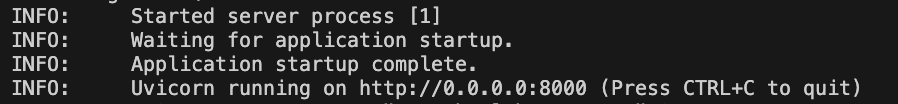
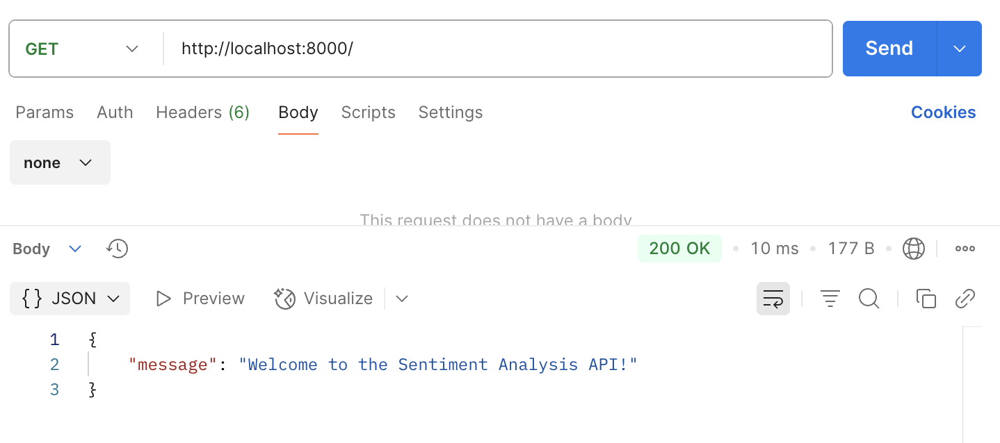
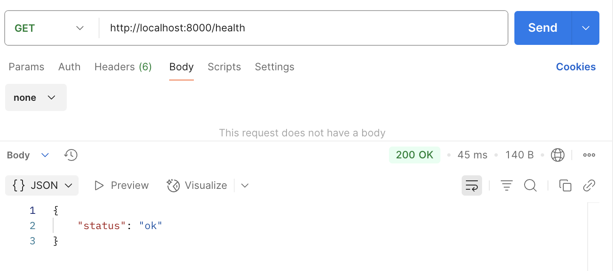
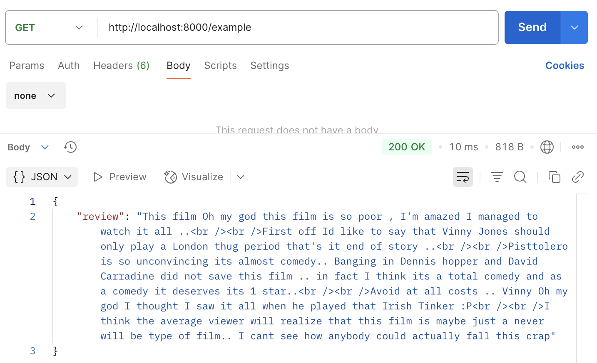
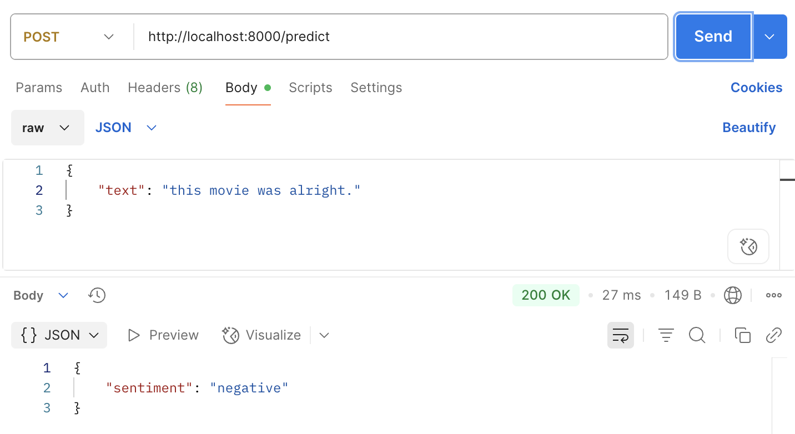
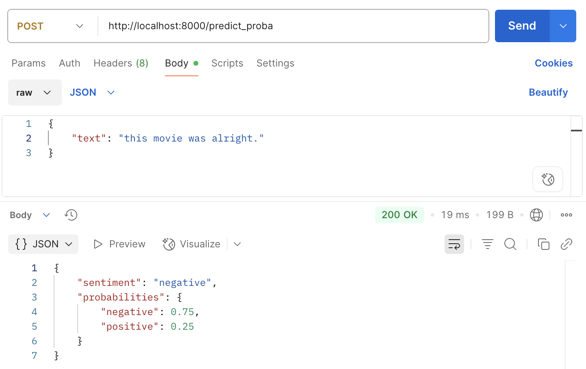
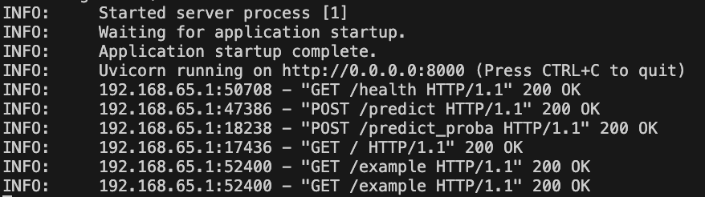
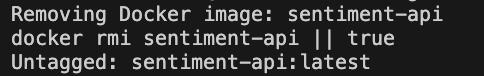

# Assignment-3
---

### **DESCRIPTION**
This project exposes a sentiment analysis model trained on IMDB movie reviews as a RESTful API using FastAPI. The model predicts whether a given review is positive or negative and can also return a confidence score. The API is containerized with Docker and ready for deployment. It serves four endpoints:

    • health check
    • prediction
    • prediction with probability
    • sample review from dataset


##### STRUCTURE

| File Name       | Purpose                                  |
|----------------|-------------------------------------------|
| `.gitignore`    | Ensures that certain files and folders are ignored by Git. |
| `main.py`     | FastAPI application with all endpoint definitions.     |
| `Dockerfile`     | Defines instructions to build a Docker image.     |
| `Makefile`     | Automates tasks using `make` (build, run, clean, help).     |
| `requirements.txt`     | Lists Python dependencies.     |
| `sentiment_model.pkl`     | Trained sentiment analysis model.     |

---
### **API ENDPOINTS**
| Method | Endpoint         | Description                                           |
|--------|------------------|-------------------------------------------------------|
| GET    | `/health`        | Health check to verify API is running                |
| POST   | `/predict`       | Takes input text and returns sentiment prediction     |
| POST   | `/predict_proba` | Same as `/predict` but includes probability/confidence score |
| GET    | `/example`       | Returns a random review from the IMDB dataset        |

#### GET /health
Purpose: Confirms that the server is up
Response:

    ```bash
    {
        "status": "ok"
    }
    ```


#### POST /predict
Request:

    ```bash
    {
        "text": "This movie makes me smile every time I watch it."
    }
    ```
Response:

    ```bash
    {
        "sentiment": "positive"
    }
    ```


#### POST /predict_proba
Request:

    ```bash
    {
        "text": "This movie was super lame."
    }
    ```
Response:

    ```bash
    {
        "sentiment": "negative",
        "probability": 0.87
    }
    ```

#### GET /example
Purpose: Returns a random view of the dataset
Response:

    ```bash
    {
        "review": "This is a very long movie, but well worth it."
    }
    ```


---
### **HOW TO RUN LOCALLY**
Below I cover how to run this locally with Docker (and without) and how to check that it is working with Postman.

#### 1. Clone the respository.

#### 2. Install the dependencies (create a virtual environment):

    ```bash
    pip install -r requirements.txt
    ```

#### 3. Run with Docker - create the image:
    ```bash
    make build
    ```

#### 4. Run the Container - this will actually start up the API
    ```bash
    make run
    ```
    In the terminal, you should see the setup of the Docker image followed by these messages:
    

    After running this, the API will be available at:
    http://localhost:8000/docs

#### 5. Check the endpoints in Postman
    **5.1** Open Postman, create a new request and paste in the API URL

    ##### 'GET' requests
    **5.2** If you type a forward slash **/** after the address and 'GET' you will see the read_root.
    

    **5.3** We can check the status of the API with **/health** and it should return status:ok, and 200.
    

    **5.4** Another 'GET' example is **/example**, which pulls one of the IMDB movie reviews and displays it
    

    ##### 'POST' requests
    Moving on from 'GET', we can explore 'POST' which allows us to send information to the API, interact with the sentiment analysis model, and get a result.
    **5.5** With the **/predict** endpoint, we can copy and paste a movie review or write our own to test the model's ability to determine if it is positive or negative.
    
    

    **5.6** The last endpoint is a step up from '/predict' --> we can also do **/predict_proba** which tells us the probability that the model assigns to its prediction as being positive or negative.

    

    **NOTE:** You can also see in the terminal which endpoints you are connecting to while testing them out on Postman:

    

#### 6. To quit, hit 'Control' + 'C', you can also do make clean to delete the Docker container. It should look something like this:



Optionally, you could just run the FastAPI without Docker:
Run the API:

    ```bash
    uvicorn main:app --reload
    ```
The FastAPI interactive docs can be found at http://127.0.0.1:8000/docs
